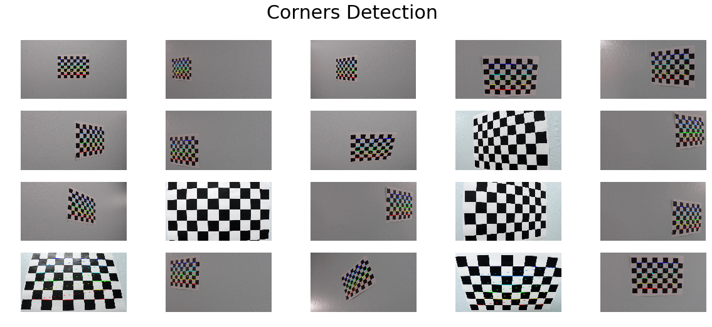
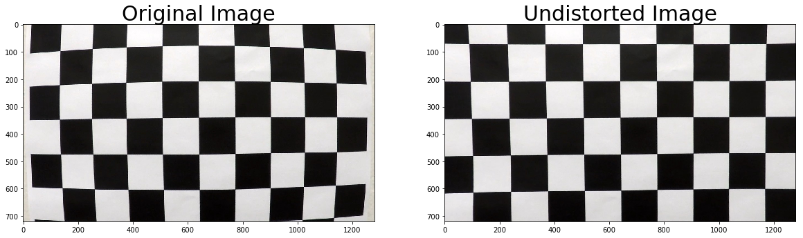
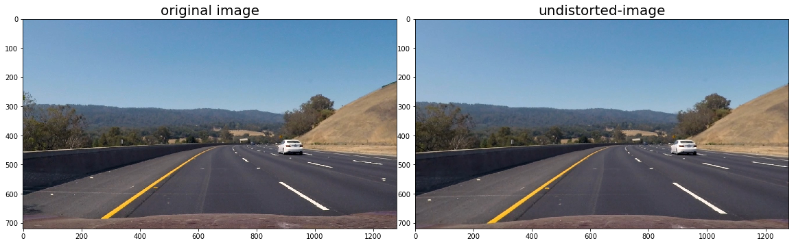
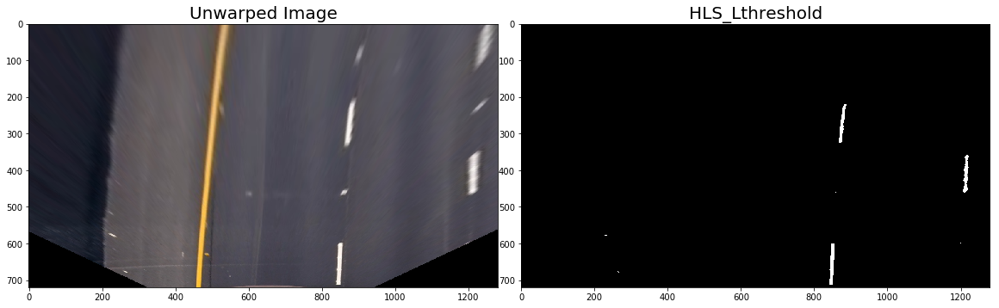
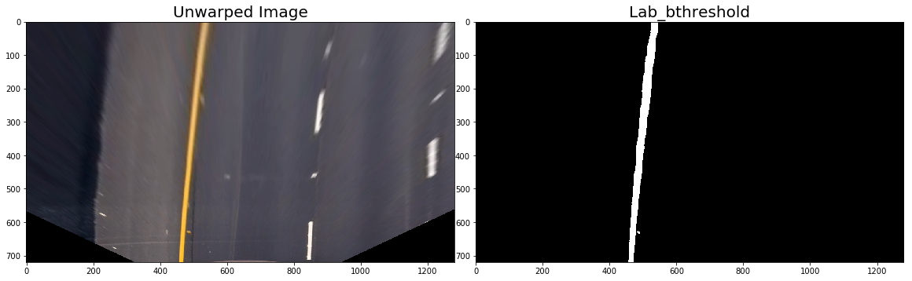
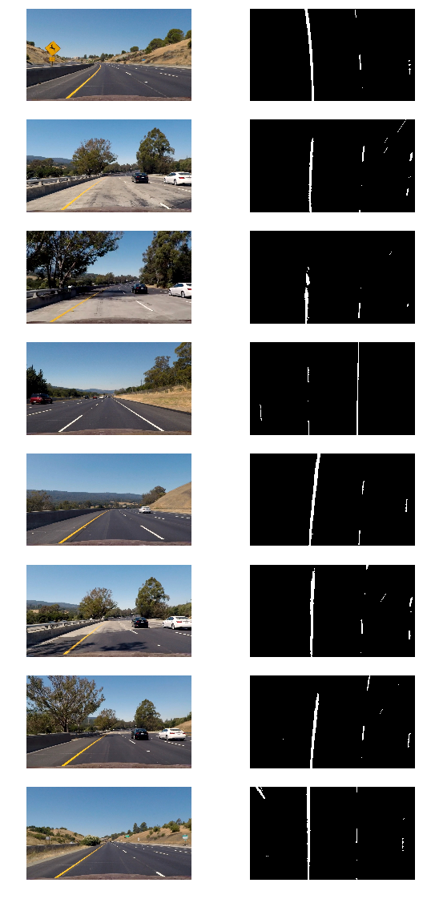
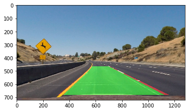
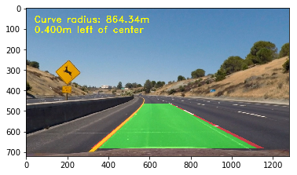

## **Advanced Lane Finding Project**

[](http://www.udacity.com/drive)

### **Overview**

The goals / steps of this project are the following:

* Compute the camera calibration matrix and distortion coefficients given a set of chessboard images.
* Apply a distortion correction to raw images.
* Use color transforms, gradients, etc., to create a thresholded binary image.
* Apply a perspective transform to rectify binary image ("birds-eye view").
* Detect lane pixels and fit to find the lane boundary.
* Determine the curvature of the lane and vehicle position with respect to center.
* Warp the detected lane boundaries back onto the original image.
* Output visual display of the lane boundaries and numerical estimation of lane curvature and vehicle position.
---

### Writeup / README

#### 1. Provide a Writeup / README that includes all the rubric points and how you addressed each one.  You can submit your writeup as markdown or pdf.  [Here](https://github.com/udacity/CarND-Advanced-Lane-Lines/blob/master/writeup_template.md) is a template writeup for this project you can use as a guide and a starting point.  

You're reading it!

### Camera Calibration

#### 1. Briefly state how you computed the camera matrix and distortion coefficients. Provide an example of a distortion corrected calibration image.

The code for this step is contained in the first code cell of the IPython notebook located in "./Advance_Lane_Finding.ipynb" 

The OpenCV functions findChessboardCorners and calibrateCamera are the backbone of the image calibration. A number of images of a chessboard, taken from different angles with the same camera, comprise the input. Arrays of object points, corresponding to the location (essentially indices) of internal corners of a chessboard, and image points, the pixel locations of the internal chessboard corners determined by findChessboardCorners, are fed to calibrateCamera which returns camera calibration and distortion coefficients. These can then be used by the OpenCV undistort function to undo the effects of distortion on any image produced by the same camera. Generally, these coefficients will not change for a given camera (and lens). The below image depicts the corners drawn onto twenty chessboard images using the OpenCV function:
    
    



### Pipeline (single images)i

#### 1. Provide an example of a distortion-corrected image.

The image below depicts the results of applying `undistort` to one of the project chess image and dashcam :




#### 2. Describe how (and identify where in your code) you used color transforms, gradients or other methods to create a thresholded binary image.  Provide an example of a binary image result.

I chose to use just the L channel of the HLS color space to isolate white lines and the B channel of the LAB colorspace to isolate yellow lines. I did not use any gradient thresholds in my pipeline. I did, however finely tune the threshold for each channel to be minimally tolerant to changes in lighting. As part of this, I chose to normalize the maximum values of the HLS L channel and the LAB B channel (presumably occupied by lane lines) to 255, since the values the lane lines span in these channels can vary depending on lighting conditions. Below are examples of thresholds in the HLS L channel and the LAB B channel:






Below are the results of applying the binary thresholding pipeline to various sample images:



#### 3. Describe how (and identify where in your code) you performed a perspective transform and provide an example of a transformed image.

The code for my perspective transform includes a function called `warper()`, which appears in lines 1 through 8 in the file `example.py` (output_images/examples/example.py) (or, for example, in The code for my perspective transform is titled "Perspective Transform" in the Jupyter notebook, in the seventh and eighth code cells from the top.  The `unwarp()` function takes as inputs an image (`img`), as well as source (`src`) and destination (`dst`) points.  I chose to hardcode the source and destination points in the following manner:

```
src = np.float32([(575,464),
                  (707,464), 
                  (258,682), 
                  (1049,682)])
dst = np.float32([(450,0),
                  (w-450,0),
                  (450,h),
                  (w-450,h)])
```


#### 4. Describe how (and identify where in your code) you identified lane-line pixels and fit their positions with a polynomial?

The functions `sliding_window_polyfit` and `polyfit_using_prev_fit`, which identify lane lines and fit a second order polynomial to both right and left lane lines, are clearly labeled in the Jupyter notebook as "Sliding Window Polyfit" and "Polyfit Using Fit from Previous Frame". The first of these computes a histogram of the bottom half of the image and finds the bottom-most x position (or "base") of the left and right lane lines. Originally these locations were identified from the local maxima of the left and right halves of the histogram, but in my final implementation I changed these to quarters of the histogram just left and right of the midpoint. This helped to reject lines from adjacent lanes. The function then identifies ten windows from which to identify lane pixels, each one centered on the midpoint of the pixels from the window below. This effectively "follows" the lane lines up to the top of the binary image, and speeds processing by only searching for activated pixels over a small portion of the image. Pixels belonging to each lane line are identified and the Numpy `polyfit()` method fits a second order polynomial to each set of pixels.


#### 5. Describe how (and identify where in your code) you calculated the radius of curvature of the lane and the position of the vehicle with respect to center.

The radius of curvature  in the code cell titled "Radius of Curvature and Distance from Lane Center Calculation" using this line of code (altered for clarity):
```
curve_radius = ((1 + (2*fit[0]*y_0*y_meters_per_pixel + fit[1])**2)**1.5) / np.absolute(2*fit[0])
```
In this example, `fit[0]` is the first coefficient (the y-squared coefficient) of the second order polynomial fit, and `fit[1]` is the second (y) coefficient. `y_0` is the y position within the image upon which the curvature calculation is based (the bottom-most y - the position of the car in the image - was chosen). `y_meters_per_pixel` is the factor used for converting from pixels to meters. This conversion was also used to generate a new fit with coefficients in terms of meters. 

The position of the vehicle with respect to the center of the lane is calculated with the following lines of code:
```
lane_center_position = (r_fit_x_int + l_fit_x_int) /2
center_dist = (car_position - lane_center_position) * x_meters_per_pix
```
`r_fit_x_int` and `l_fit_x_int` are the x-intercepts of the right and left fits, respectively. This requires evaluating the fit at the maximum y value (719, in this case - the bottom of the image) because the minimum y value is actually at the top (otherwise, the constant coefficient of each fit would have sufficed). The car position is the difference between these intercept points and the image midpoint (assuming that the camera is mounted at the center of the vehicle).

#### 6. Provide an example image of your result plotted back down onto the road such that the lane area is identified clearly.





---

### Pipeline (video)

#### 1. Provide a link to your final video output.  Your pipeline should perform reasonably well on the entire project video (wobbly lines are ok but no catastrophic failures that would cause the car to drive off the road!).

Here's a [link to my video result](./project_video_output.mp4)
Here's a [link to my video result](./challenge_video_output.mp4)

---

### Discussion

#### 1. Briefly discuss any problems / issues you faced in your implementation of this project.  Where will your pipeline likely fail?  What could you do to make it more robust?

The problems I encountered were almost exclusively due to lighting conditions, shadows, discoloration, etc.

I've considered a few possible approaches for making my algorithm more robust. These include more dynamic thresholding.designating a confidence level for fits and rejecting new fits that deviate beyond a certain amount


```python

```
